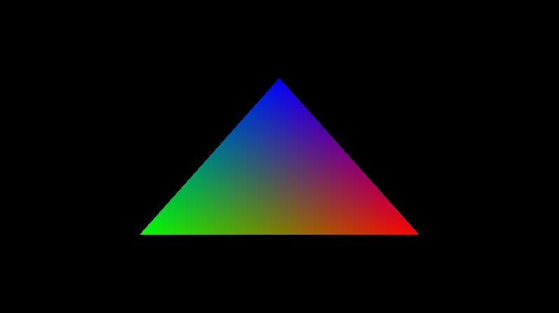

# 1.2 buffer数据传递

在1.1章节中，我们绘制的三角形的顶点数据是写死在着色器代码中的。而绝大部分情况，顶点的数据是从外部获取的。例如我们想要渲染模型，就需要解析顶点数据，将数据传入到着色器内进行计算。因此本章节需要优化上一节的demo，实现通过buffer传递三角形的顶点位置与颜色数据渲染一个渐变色三角形。

## 1.2.1 顶点buffer

首先我们创建一个关于三角形顶点位置信息的buffer（方便起见我们创建的是二维的坐标）：

```javascript
const verticesData = new Float32Array([
    0, 0.5,
    -0.5, -0.5,
    0.5, -0.5,
]);
const verticesBuffer = device.createBuffer({
    size: verticesData.byteLength,
    usage: GPUBufferUsage.VERTEX,
    mappedAtCreation: true
});
new Float32Array(verticesBuffer.getMappedRange()).set(verticesData);
verticesBuffer.unmap();	
```

上述代码，我们先创建了一个32位浮点数组，将3个二维坐标值写入数组。然后我们创建buffer。size参数表示数据的总占用字节数。usage表明该buffer用于什么操作。mappedAtCreation设为true从而buffer在创建的后CPU可在它内容上操作。buffer刚刚创建完成，就是申请了一块大小为size的一块内存，里面还没有任何数据，因此需要再通过32位浮点数组进行塞数据操作。getMappedRange可以得到ArrayBuffer，但是ArrayBuffer是静态的不可直接写入数据，必须通过类型数组变相设置数据。注意的是如果buffer进行了map操作，那么这个buffer将不能再被gpu使用，只能被CPU使用。所以当我们将数据存入buffer之后必须进行unmap操作，这样GPU才能使用（CPU就无法操作unmap之后的buffer）。

以此类推，我们可以再创建一个buffer用于存放顶点的颜色数据：

```javascript
const colorData = new Float32Array([
    0, 0, 1,
    0, 1, 0,
    1, 0, 0
]);
const colorBuffer = device.createBuffer({
    size: colorData.byteLength,
    usage: GPUBufferUsage.VERTEX,
    mappedAtCreation: true
});
new Float32Array(colorBuffer.getMappedRange()).set(colorData);
colorBuffer.unmap();
```

## 1.2.2 着色器参数

之前我们是着色器里写死了数据，这次我们需要修改着色器代码，使其可以接收外部传进来的顶点数据。

#### wgsl

顶点着色器

```wgsl
[[builtin(position)]] var<out> out_position : vec4<f32>;
[[location(0)]] var<out> out_color : vec3<f32>;
[[location(0)]] var<in> a_position : vec2<f32>;
[[location(1)]] var<in> a_color : vec3<f32>;
[[stage(vertex)]]
fn vtx_main() -> void {
    out_position = vec4<f32>(a_position, 0.0, 1.0);
    out_color = a_color;
    return;
}
```

片段着色器

```wgsl
[[location(0)]] var<out> fragColor : vec4<f32>;
[[location(0)]] var<in> in_color : vec3<f32>;
[[stage(fragment)]]
fn frag_main() -> void {
    fragColor = vec4<f32>(in_color, 1.0);
    return;
}
```

我们再原先顶点着色器代码做了修改，去掉了写死数据，然后用location去标注出入参数的槽位索引。并且将颜色数据原封不动抛出。在片段着色器里接收颜色参数。这个颜色已经被GPU做了插值处理。

#### glsl

顶点着色器

```glsl
#version 450
layout(location = 0) in vec2 a_position;
layout(location = 1) in vec3 a_color;

layout(location = 0) out vec3 fragColor;

void main() {
    gl_Position = vec4(a_position, 0.0, 1.0);
    fragColor = a_color;
}
```

片段着色器

```glsl
#version 450
layout(location = 0) in vec3 fragColor;
layout(location = 0) out vec4 outColor;

void main() {
    outColor = vec4(fragColor, 1.0);
}
```

glsl的逻辑与wgsl相同。

## 1.2.3 管线更新

我们写好了着色器代码，创建好了buffer，那么我们要如何才能把buffer的数据让着色器去使用？首先需要通过渲染管线设置参数槽位。

```javascript
const pipeline = device.createRenderPipeline({
	// ... 与上一节相同的设置
    vertexState: {
        vertexBuffers:[{
            arrayStride: 2 * verticesData.BYTES_PER_ELEMENT,
            attributes:[{
                shaderLocation: 0,
                offset: 0,
                format: "float2"
            }]
        }, {
            arrayStride: 3 * colorData.BYTES_PER_ELEMENT,
            attributes:[{
                shaderLocation: 1,
                offset: 0,
                format: "float3"
            }]
        }]
    }
});
```

由于数据都在顶点着色器内，因此在渲染管线需要添加vertexState字段。我们传入2个buffer数据。这2个buffer的数组stride不同，格式不同。所以拆分为2个vertexBuffers的元素。假设有多个buffer的stride和格式相同，那么我们可以把2个buffer并为一个vertexBuffers元素，然后在attributes数组中写不同的槽位设置。

## 1.2.4 传入buffer并渲染
我们在上一部创建了槽位，目的就是在渲染的时候按照槽位顺序依次插入buffer，从而着色器可以获取参数。

```javascript
passEncoder.setPipeline(pipeline);
passEncoder.setVertexBuffer(0, verticesBuffer);
passEncoder.setVertexBuffer(1, colorBuffer);
passEncoder.draw(3, 1, 0, 0);
```

如代码所示传递buffer需要指定槽位。槽位与着色器代码里定义的槽位要对应。

一切顺利的话就可以渲染出来一个彩色的三角形：



<a href="../examples/chapter1/buffer/index.html" target="_blank">DEMO地址</a>

## 1.2.5 合并buffer

我们发现传入的数据都是与顶点相关的数据，无非一个buffer存了位置信息，一个存颜色信息。那么我们可以把这两个buffer用一个buffer代替。这一个buffer同时包含位置与颜色信息。

首先我们需要只使用一个32位浮点数组来记录所有顶点：

```javascript
const vertexData = new Float32Array([
    0, 0.5, 0, 0, 1,
    -0.5, -0.5, 0, 1, 0,
    0, -0.5, 1, 0, 0
]);
const vertexBuffer = device.createBuffer({
    size: vertexData.byteLength,
    usage: GPUBufferUsage.VERTEX,
    mappedAtCreation: true
});
new Float32Array(vertexBuffer.getMappedRange()).set(vertexData);
vertexBuffer.unmap();
```

在新的顶点数据中，我们按照5个浮点数为一组作为一个顶点的数据。前两个为顶点位置，后三个为颜色。其他操作与之前的例子完全相同。

然后是渲染管线插槽部分的改动：

```javascript
const pipeline = device.createRenderPipeline({
	// ... 与上一节相同的设置
    vertexState: {
        vertexBuffers:[{
            arrayStride: 5 * vertexData.BYTES_PER_ELEMENT, // 注意此处改动
            attributes:[{
                shaderLocation: 0,
                offset: 0,
                format: "float2"
            }]
        }, {
            arrayStride: 5 * vertexData.BYTES_PER_ELEMENT,
            attributes:[{
                shaderLocation: 1,
                offset: 2 * vertexData.BYTES_PER_ELEMENT, // 注意此处改动
                format: "float3"
            }]
        }]
    }
});
```

首先我们已经将数据5个作为一组，所以在arrayStride字段改成5个32位浮点占用字节数。由于一个buffer数据即表示位置也表示颜色，所以在第二个attribute设置的地方，offset设为2个32位浮点占用字节数，即跳过位置数据取颜色数据。

当然，我们可以把上述代码化简写法变成如下：

```javascript
const pipeline = device.createRenderPipeline({
	// ... 与上一节相同的设置
    vertexState: {
        vertexBuffers:[{
            arrayStride: 5 * vertexData.BYTES_PER_ELEMENT, // 注意此处改动
            attributes:[{
                shaderLocation: 0,
                offset: 0,
                format: "float2"
            }, {
                shaderLocation: 1,
                offset: 2 * vertexData.BYTES_PER_ELEMENT, // 注意此处改动
                format: "float3"
            }]
        }
    }
});
```

最后渲染的地方传入buffer处，都传入同一个buffer即可。一切顺利的话就可以得到相同的运行效果。

<a href="../examples/chapter1/buffer-merge/index.html" target="_blank">DEMO地址</a>

## 1.2.6 总结
使用buffer传入数据，需要注意：
1. shader代码里面设好槽位：location
2. 渲染管线设置槽位，一定要主要占用的字节数，是否需要offset
3. 渲染操作塞入buffer也要主意好槽位

所有的槽位必须全部对应上才能得到正确的运行结果。
